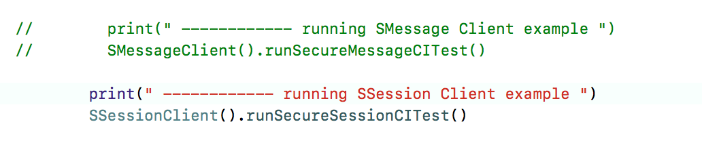
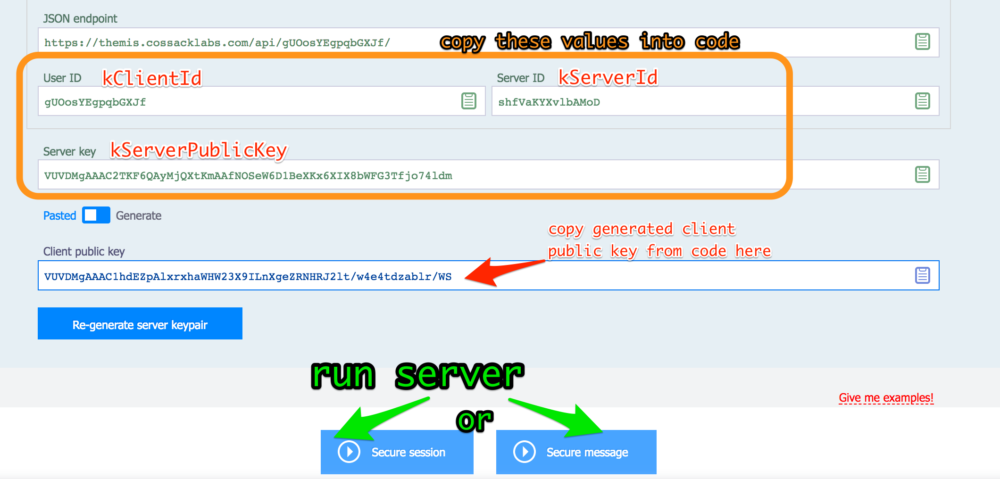

# How to use Themis Server with Swift     

0. [Install Pods](https://docs.cossacklabs.com/pages/swift-howto/#installing-stable-version-from-cocoapods)
1. Run the app (yes, it crashes on asserts – this is fine :)
2. Open `AppDelegate` and choose a Client example for either SMessage ([Secure Message](https://docs.cossacklabs.com/pages/secure-message-cryptosystem/)) or SSession ([Secure Session](https://docs.cossacklabs.com/pages/secure-session-cryptosystem/)). Uncomment the necessary mode to start.     





## Secure Session mode   

Let's assume, you want to play with [Secure Session](https://docs.cossacklabs.com/pages/secure-session-cryptosystem/).

3. Open `SSessionClient` file.

### Client key generation   

4. Find the following lines:

```swift
// ---------------------- KEY GENERATION ---------------------------------------

        // uncomment to re-generate keys
//         generateClientKeys()
//         return;
        
// ---------------------- END KEY GENERATION -----------------------------------
```
5. Uncomment key generation and run the example. The console output will look something like this:

```swift
 ------------ running SSession Client example 
EC privateKey = UkVDMgAAAC0lV2hOAKFJZyAOLFkzavGzxP8v0Byrs9r5N4u1rm4qYSTLqf+2
EC publicKey = VUVDMgAAAC1hdEZpAlxrxhaWHW23X9ILnXgeZRNHRJ2lt/w4e4tdzablr/WS
```

6. Copy the keys to a text file.  
7. Comment the lines of the key generation function (`generateClientKeys()`), you no longer need it.   
8. Find the constants of the Client keys in the code and paste the generated keys:

```swift 
let kClientPrivateKey: String = "UkVDMgAAAC0lV2hOAKFJZyAOLFkzavGzxP8v0Byrs9r5N4u1rm4qYSTLqf+2"
let kClientPublicKey: String = "VUVDMgAAAC1hdEZpAlxrxhaWHW23X9ILnXgeZRNHRJ2lt/w4e4tdzablr/WS"
```
    
### Server key generation   

The idea is to let the Server know the Client's public key, and let the Client know the Server ID and the public key.

 
9. Open [Themis Server](https://docs.cossacklabs.com/simulator/interactive/).  
10. Log in with your existing Themis Server credentials or [register](https://docs.cossacklabs.com/pages/using-themis-server/#registration). 

>Note: The UI of Themis Server is gradually (albeit constantly) evolving. Don’t be surprised to see that some of the UI elements have changed their colour or that some buttons have moved around a little. The core functionality of Themis Server stays the same.    

11. After logging in:    
- Copy the User ID from the Server interface to `kUserId` in code.
- Copy Server ID from the Server interface to `kServerId` in code.
- Copy the Server Key from the Server interface to `kServerPublicKey` in code.
- Paste `kClientPublicKey` to the Client public key in the Server interface.




The code will now look something like this:

```swift
let kUserId: String = "gUOosYEgpqbGXJf"
let kServerId: String = "shfVaKYXvlbAMoD"
let kServerPublicKey: String = "VUVDMgAAAC2TKF6QAyMjQXtKmAAfNOSeW6D1BeXKx6XIX8bWFG3Tfjo74ldm"
    
let kClientPrivateKey: String = "UkVDMgAAAC0lV2hOAKFJZyAOLFkzavGzxP8v0Byrs9r5N4u1rm4qYSTLqf+2"
let kClientPublicKey: String = "VUVDMgAAAC1hdEZpAlxrxhaWHW23X9ILnXgeZRNHRJ2lt/w4e4tdzablr/WS"
```

### Launching everything   

12. Start Themis Server in Secure Session mode (press the corresponding button).
13. Run the app in Secure Session mode.
   - don't forget to uncomment the Secure Session mode in AppDelegate
   - don't forget to comment out key generation
   
14. Enjoy playing around with Themis Server!


## Secure Message mode   

Follow the same steps as described above, but do it for `SMessageClient` file :) Run Themis Server in Secure Message mode.


## Useful reading  

To get most of Themis Server, read a [detailed explanation of how Themis Server Simulator works](https://docs.cossacklabs.com/pages/using-themis-server/).
